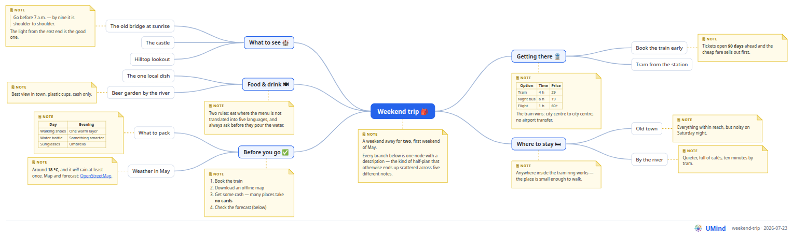

# UMind <sub></sub>

**Think in an outline, share as a picture.** UMind is a minimalist, self-hosted
mind-mapping app — one HTML file, plain JavaScript, no build step, no account,
no cloud. Your maps live in your browser and in `.json` files you own.

**▶ Try it live:** **https://pponec.github.io/UMind/?welcome**

[](docs/images/graph-example.png)

<sup>The picture above is real UMind output — every node, every description,
one SVG file. Click it for full size.</sup>

## Two modes, one document

### ✍️ Edit — hands stay on the keyboard

The editor is an **outliner**: a nested list you grow by typing. No dragging
boxes around a canvas, no layout to fiddle with — the structure *is* the map.

| Key | Does |
|---|---|
| <kbd>Enter</kbd> | new node below |
| <kbd>Tab</kbd> / <kbd>Shift</kbd>+<kbd>Tab</kbd> | indent / outdent |
| <kbd>↑</kbd> <kbd>↓</kbd> | move between nodes |
| <kbd>Alt</kbd>+<kbd>↑</kbd> / <kbd>Alt</kbd>+<kbd>↓</kbd> | reorder among siblings |
| <kbd>Alt</kbd>+<kbd>Enter</kbd> | write a **description** (Markdown) |
| <kbd>Backspace</kbd> on an empty node | delete it, keep its children |
| <kbd>Ctrl</kbd>+<kbd>Z</kbd> / <kbd>Ctrl</kbd>+<kbd>Shift</kbd>+<kbd>Z</kbd> | undo / redo |

The mouse is welcome too: drag the ⠿ grip to move a branch anywhere, click
▸ / ▾ to fold one away.

### 🖼 Present — one click to a picture

**Show graph** turns the whole document into a two-sided mind map: the root in
the middle, branches fanning left and right, curved connectors, and every
description drawn as a note beside the node it belongs to — **rendered
Markdown**, with lists, tables, code and links intact.

- The layout is computed for you, and packs itself so a long note never pushes
  the rest of the map down.
- Always light, whatever your theme, so it prints and shares well.
- The picture signs itself: logo, project name and export date in the corner.
- **Download SVG** saves it; text stays text, so it scales to any size.

## Why you might like it

- **Your data stays yours.** Everything is auto-saved in your browser; *Save*
  and *Open* move plain `.json` files to and from your disk. Nothing is ever
  sent to a server — there is no server. (Which also means sharing is a
  deliberate act: [send the file](#where-your-maps-live--and-how-to-share-one).)
- **Nothing to install.** Copy `docs/` onto any static host — or open it
  straight from GitHub Pages, as above.
- **Nothing to learn.** If you can write a bullet list, you can use it.
- **No lock-in and no bloat.** Under 2 800 lines of vanilla JavaScript, zero
  dependencies, Apache 2.0.

## Quick start

```
python3 run.py       # then open http://localhost:8000/
```

No Python? `java Run.java` does the same (Java 17+, no build step). Both take
an optional port: `python3 run.py 9000`. A plain static server works too:

```
python3 -m http.server -d docs 8000
```

Opening `docs/index.html` via `file://` also works, but browsers may switch
localStorage off there; use **Save** / **Open** to keep a `.json` file instead.

## Where your maps live — and how to share one

**In your browser, and nowhere else.** Every change is auto-saved to that
browser's **localStorage** under the project's name. There is no server, no
account and no sync: nothing you type ever leaves your machine.

That also means a map is **private to one browser on one device**. It is not
visible to anyone else, and it will not follow you to your phone or to another
browser on the same computer. Clearing the browser's site data removes it.

**To share a map — or move it — send the file:**

1. **Save** (or **Save As…**) writes the whole document to a `.json` file.
2. Send that file, drop it in a shared folder, commit it to a repository —
   it is plain text.
3. The other side presses **Open…** and picks it up.

For a read-only copy that anyone can look at without UMind, use **Show graph →
Download SVG**: one self-contained picture, viewable in any browser.

## The address bar is part of the app

The query is simply the project's name, optionally with a `/graph` tail — so
delete the tail and you are editing the same map.

| URL | Opens |
|---|---|
| `…/UMind/` | the project you had open last |
| `…/UMind/?my-map` | the project saved as `my-map` |
| `…/UMind/?my-map/graph` | its picture |
| `…/UMind/?welcome` | the guided welcome map |

> **A link is not a copy.** `?my-map` picks a project out of *your own*
> browser storage. Sending that URL to somebody else opens *their* browser with
> no such project — send them the `.json` file instead (see above).

`?welcome` is the exception, because it carries no data of its own: it is
always safe to share. The welcome map is a preview that is never saved, your
own maps stay untouched, and a plain reload returns to your work.

## Try the sample maps

`test/json/` holds ready-made documents — open one with **Open…**:

| File | Shows |
|---|---|
| `06-readme-example.json` | the map pictured at the top of this page |
| `01-note-sizes.json` | descriptions from one line to very long |
| `02-deep-nesting.json` | five levels of structure |
| `03-tree-shapes.json` | branches of wildly different shape |
| `04-notes-everywhere.json` | a description on every single node |
| `05-markdown-notes.json` | tables, code, quotes, escaping |

## Images in node descriptions

Descriptions are Markdown, so they can embed images with ``. How
`src` resolves is governed by the browser's security model:

| `src` value | Result |
|---|---|
| `https://example.com/pic.png` | Loads from that server. Works anywhere. |
| `images/pic.png` (relative) | Resolved against the **page origin** (e.g. `https://…github.io/UMind/images/pic.png`), so the image must be deployed alongside the app — never read from the visitor's disk. |
| `file:///home/me/pic.png` | **Blocked.** Browsers refuse to load `file://` from a page served over `http`/`https`. |
| `data:image/png;base64,…` | Embedded inline; works everywhere. Note it is stored in the document JSON / localStorage, so keep such images small. |

**You cannot reference an image from the local filesystem** (`file://`) from a
hosted page — that includes GitHub Pages. To use a local image, drop the file
in `docs/images/logo.png`, start a launcher above, and write in a description:

```markdown

```

The browser then requests `http://localhost:8000/images/logo.png`, and the same
relative reference keeps working after deployment, provided the file is
committed and published with the app.

## Under the hood

The whole app is a handful of static files in **`docs/`** — `index.html`,
`app.js`, `markdown.js`, `svg-export.js`, `welcome.js`, `style.css` — which is
exactly what GitHub Pages publishes (**Deploy from a branch → `/docs`**).

- **Vanilla JavaScript.** Not a version but an approach: no framework, no
  library, no bundler, no polyfills, no ES modules — just `<script src="…">`.
- **ECMAScript 2017.** The newest syntax used is `async`/`await`; no optional
  chaining or other ES2020+ constructs.
- **Runs in any evergreen browser from late 2023** — Chrome/Edge 105+,
  Safari 15.4+, Firefox 121+. (The limits are the CSS `:has()` selector and
  Pointer Events, not the JavaScript.) Saving to a real file on disk uses the
  File System Access API where available (Chromium) and falls back to a
  download plus file picker everywhere else.
- The Markdown renderer is our own — a JavaScript port of Ujorm's
  `MarkdownToHtmlConverter` — and builds DOM nodes, so all text is escaped by
  construction.

## Similar open-source projects

Other lightweight, actively maintained, browser-based mind-map / outliner
projects with an English UI that (like UMind) run fully offline and keep your
data in a plain file:

- **[Mind Elixir](https://github.com/SSShooter/mind-elixir-core)** — Framework-agnostic JavaScript/TypeScript mind-map core with a clean, fast UI; runs entirely in the browser, imports and exports the whole map as JSON, and also exports PNG/SVG. MIT.
- **[Markmap](https://github.com/markmap/markmap)** — Turns plain Markdown into an interactive mind map (via D3.js) and can generate self-contained offline HTML files, so a single `.md` file stays the source of truth. MIT.
- **[jsMind](https://github.com/hizzgdev/jsmind)** — Small, dependency-free JavaScript mind-map library that renders and edits in the browser (SVG/canvas) and loads/saves the map as JSON. BSD.

## License

[Apache License 2.0](LICENSE) — free to use, modify and self-host, with an
explicit patent grant.
