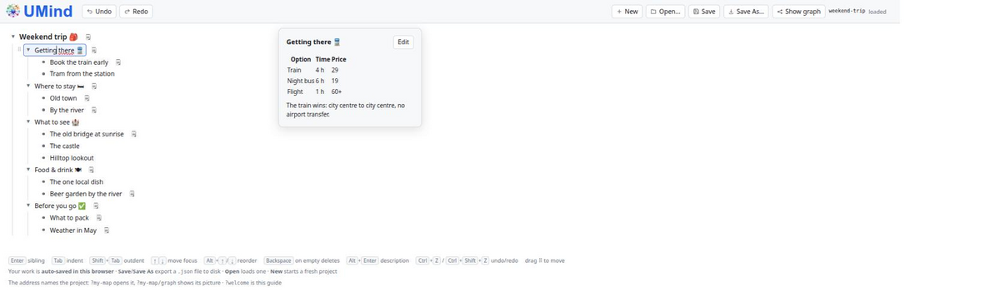
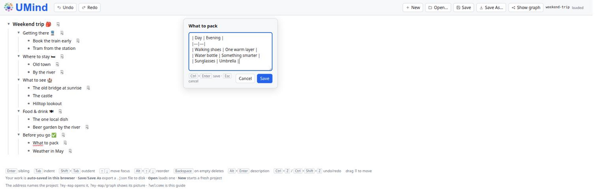

<!--
Draft of a dev.to article introducing UMind.

The three pictures live next to this file, so the links below work while you
preview the draft locally. Before publishing, upload them to dev.to (the editor's
image button) and replace each path with the URL dev.to gives back:

  screenshot-editor.png
  screenshot-note-editor.png
  ../docs/images/graph-example.png

dev.to renders article images at about 880 px wide, so every picture here is
already cropped to the interesting part and saved 1200 px wide — it scales down
cleanly and still looks sharp on a retina screen.

Suggested tags: #javascript #showdev #opensource #productivity
-->

# A mind map you can type — meet UMind

If you have ever tried to think and drag boxes at the same time, you know what's
coming. You have an idea, you reach for a mind-map tool, and the next ten minutes
go into moving rectangles so the lines stop crossing. By the time the picture is
tidy, the thought is gone.

So I wrote [UMind](https://github.com/pponec/UMind): a mind map you write as an
outline and read as a picture. It is one HTML file plus a few scripts — no
framework, no build step, no account, no server.

**▶ Try it live:** https://pponec.github.io/UMind/?welcome

## The whole trick: the browser already is a mind-map engine

The browser gives you a tree (the DOM), a layout engine (CSS) and a text editor
(`contenteditable`) for free. So UMind writes no rendering engine and no layout
algorithm for editing. A map is a nested list of editable nodes — the structure
*is* the map.



That is a real map, not a mockup. Everything you see is a `<ul>`, a few `<li>`s
and one contenteditable per node.

## Type first, look later

The editor is built for hands that never leave the keyboard:

| Key | Does |
|---|---|
| <kbd>Enter</kbd> | new node below |
| <kbd>Tab</kbd> / <kbd>Shift</kbd>+<kbd>Tab</kbd> | indent / outdent |
| <kbd>↑</kbd> <kbd>↓</kbd> | move between nodes |
| <kbd>Alt</kbd>+<kbd>↑</kbd> / <kbd>Alt</kbd>+<kbd>↓</kbd> | reorder among siblings |
| <kbd>Alt</kbd>+<kbd>Enter</kbd> | write a description |
| <kbd>Backspace</kbd> on an empty node | delete it, keep its children |
| <kbd>Ctrl</kbd>+<kbd>Z</kbd> / <kbd>Ctrl</kbd>+<kbd>Shift</kbd>+<kbd>Z</kbd> | undo / redo |

The mouse is welcome too — drag the ⠿ grip to move a whole branch, click ▸ / ▾
to fold one away — but you never need it.

## Every node can carry a description, and it is Markdown

A node title is one line. The thinking usually is not. So every node has an
optional description behind <kbd>Alt</kbd>+<kbd>Enter</kbd>: lists, tables, code,
quotes, links, images.



The Markdown renderer is my own — a JavaScript port of Ujorm's
`MarkdownToHtmlConverter`. It builds DOM nodes rather than an HTML string, so
every piece of text is escaped by construction and there is no sanitizer to
trust.

## One click to a picture

An outline is for writing. A mind map is for showing. **Show graph** turns the
whole document into a two-sided map: root in the middle, branches fanning left
and right, curved connectors — and every description drawn as a note beside the
node it belongs to, as **rendered Markdown**, tables and all.


The layout is computed for you and packs itself, so one long note does not push
the rest of the map down. The palette stays light whatever your theme, because a
picture you share ends up in a document or a printer. **Download SVG** saves it:
text stays text, so it scales to any size.

## Nothing to install — the app *is* the page

There is no installer, no npm, no bundle step, no runtime to keep updated.
Download the repository as a ZIP, keep the `docs/` folder, and that folder *is*
the application — six static files. Copy it anywhere and serve it:

```
python3 run.py       # then open http://localhost:8000/
```

No Python? `java Run.java` does the same. Or use any static server you already
have — `python3 -m http.server -d docs 8000`. Put the folder on any web space,
an intranet share or a USB stick and it works there too; GitHub Pages serves the
very same files as the live demo above. Once the page is loaded it needs no
network at all. (Do serve it over `http` rather than double-clicking the file —
some browsers switch storage off for `file://` pages.)

## No login, because there is nothing to log in to

Every change is auto-saved to your browser's `localStorage` — on your machine,
and nowhere else. That single fact removes a whole layer of the usual app: there
is **no sign-up, no password, no OAuth, no session, no permissions to
configure**, because there is no server holding your data and therefore nothing
to authorize. Open the page and start typing; the first node is three seconds
away, not one confirmation e-mail away.

**Save** / **Open** move plain `.json` files between the app and your disk:

```json
{
  "version": 1,
  "rootId": "n_root",
  "root": {
    "id": "n_root",
    "text": "Weekend trip",
    "note": "A weekend away for **two**.",
    "children": [ … ]
  }
}
```

A recursive tree, no flat node table, no ids to resolve — you can read it, diff
it, commit it, or generate it from a script.

The flip side is honest and worth saying out loud: a map lives in one browser on
one device, it will not follow you to your phone, and clearing the site data
removes it. Sharing is therefore a deliberate act — you send the file, or you
send the SVG.

## The address bar is part of the app

The query string is simply the project's name, optionally with a `/graph` tail —
so deleting the tail lands you in the editor of the same map:

| URL | Opens |
|---|---|
| `…/UMind/` | the project you had open last |
| `…/UMind/?my-map` | the project saved as `my-map` |
| `…/UMind/?my-map/graph` | its picture |
| `…/UMind/?welcome` | the guided welcome map |

`?my-map` picks a project out of *your own* browser storage, so sending that URL
to a colleague opens *their* browser with no such project. `?welcome` is the
exception — it carries no data, never touches what you have saved, and is always
safe to share.

## What this is NOT

Not a canvas. You do not position anything; if you want a node somewhere else,
you move it in the outline.

Not a cloud app. No account, no sync, no telemetry, no "workspace" you get
invited to.

And not a phone app. UMind is built around a keyboard, and on Android the
on-screen keyboard opens as soon as you touch a node and eats half the screen.
Reading a map and looking at the picture are fine on a phone; writing one is
cramped, and making that pleasant is not on the roadmap.

## When does this make sense?

If you need real-time collaboration, comments and shared workspaces, use a
hosted tool. If you want to think in an outline, keep the result in a plain file
you own, and hand somebody a single self-contained picture — that is the sweet
spot. Under 2 800 lines of vanilla JavaScript, zero dependencies, Apache 2.0,
runs in any evergreen browser.

**Useful links:**

- [Live demo](https://pponec.github.io/UMind/?welcome)
- [Source code on GitHub](https://github.com/pponec/UMind)
- [Sample maps](https://github.com/pponec/UMind/tree/main/test/json) — open one with **Open…**

Curious how other people keep their maps: a dedicated app, plain Markdown, or
something you wrote yourself?
