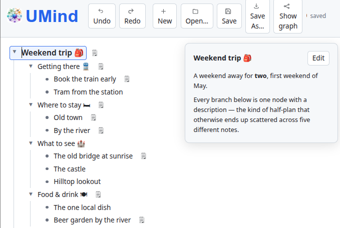
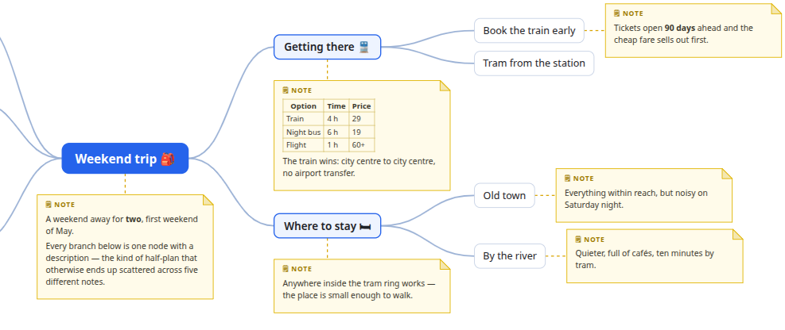

<!--
English version of the article about UMind, told through one example: planning a trip.

The two pictures live next to this file:

  img-edit.png    — editing mode
  img-graph.png   — presentation mode

Before publishing, upload both with the dev.to image button and replace the
paths with the URLs dev.to returns.

Suggested tags: #showdev #javascript #productivity #opensource
-->

# UMind: a lightweight mind-mapping app, told through planning a trip

A mind map is a visual tool for organizing thoughts, for planning and for learning
more effectively: instead of writing long stretches of prose it uses a tree structure.
Everything starts with a central topic, out of which grow the main branches standing
for the key areas, and those in turn split into more detailed notes, ideas or
examples. This style naturally mirrors the way the brain works with associations, so
you see the connections at a glance and remember the information far more easily.

**UMind** is a small application for writing such a tree down. Each node holds a short
title, the kind you can read at a glance, and optionally a longer description as well:
a paragraph of reasoning, a table of prices, a link, a checklist — in short, whatever
would otherwise end up scribbled in the margin of a sheet of paper and get lost.

The whole application is a static web page: a handful of HTML, JavaScript and CSS
files, no build, no dependencies. There is no server backend and no telemetry, so
nothing you type ever leaves your computer. That has two pleasant consequences.
Nothing needs to be installed — either you open the page on the web, or you copy the
folder of files onto your own web space, a company drive or a USB stick, and the app
works offline from then on. And nobody has to register anywhere: no account, no
password, no confirmation email — there is no server that could hold an account in
the first place.

Maps are auto-saved into the browser's own storage (`localStorage`) as you type, which
means they live in one browser on one computer; clear that browser's site data and the
maps go with it. That is what the *Save* button is for: it writes the whole document
into a plain `.json` file that belongs to you, and *Open* reads it back — on another
computer, if you like.

The app can also be run locally, without the internet. The project contains two helper
scripts that start a small web server: one needs Python 3 (`python3 run.py`),
the other Java 17+ (`java Run.java`); both then serve the page at
`http://localhost:8000/`. Opening `index.html` straight from disk over `file://` works
too, but some browsers switch `localStorage` off there and the map will not save
itself — which is why the local server is the better choice.

When writing, the keyboard comes first. <kbd>Enter</kbd> creates the next node on the
same level, <kbd>Tab</kbd> nests one level deeper and <kbd>Shift</kbd>+<kbd>Tab</kbd>
brings you back up; <kbd>Alt</kbd>+<kbd>Enter</kbd> opens the dialog with the detailed
description of the currently selected node. The mouse is handy for dragging a whole
branch somewhere else (by the grip on the node's left edge) or for folding away one
that is finished. The content of the map is written in editing mode, and a single
button (*Show graph*) turns it into a picture in presentation mode.

## Editing mode: how a plan takes shape

Suppose we are planning a weekend away with the team, but none of the details are
settled yet. The destination becomes the root of the mind map. Right away we can also
write down a few basic questions we want answered: how do we get there, where do we
sleep, what do we want to see, where do we eat, and what has to be done before we
leave. It takes only a moment, but it gives the map its shape; every answer we find
later already has its place in it.

Answers usually arrive out of order. A colleague mentions that the old bridge is worth
seeing at sunrise — so a child of *What to see* appears, and the reason for sunrise in
particular, which is the part most often forgotten, goes into its description.
Comparing the train, the night bus and the flight ends up as a small table in the
description of *Getting there*, together with the one sentence that settles it: the
train wins because it runs city center to city center. A week later the table is still
in place, so nobody has to re-open five tabs to remember why the €19 night bus was
rejected.

The outline itself keeps moving all the while. *Beer garden by the river* first shows
up under the sights and quietly migrates to *Food & drink*;
<kbd>Alt</kbd>+<kbd>↑</kbd> reorders nodes on the same level the moment it turns out
food matters more than castles; and a finished branch can be folded away to give room
to the unfinished ones. The titles stay skimmable, the research stays within reach,
and the plan stops living in six places at once.

## Presentation mode: the same document as a picture

From raw text notes, one button then produces a tidy graph. The main topic sits in the
middle, the related branches are spread evenly on both sides, and the detailed notes
are drawn next to the nodes they belong to — those can be formatted with basic Markdown
syntax. The layout is computed by the app, so there is nothing left to drag into place.
The finished graph can be downloaded as a single SVG file that opens in any browser,
phone included.

With colleagues you can then share either the finished picture, or the data itself in
the plain-text JSON format, which everyone can go on editing in their own copy of the
app. Such a file can be shared through a Git repository, for instance.

## What it adds up to

The end goal is not the mind-map picture, but the decision. UMind is built on exactly
that idea: the outline is where the thinking happens, the picture is what gets handed
over, and both are files you own. No account to create, no service to trust, nothing to
install, and nothing that stops working when some company changes its plans.

If you would like to try it, the guided welcome map is at
[pponec.github.io/UMind/?welcome](https://pponec.github.io/UMind/?welcome) and the
source code — plain JavaScript, no framework, no build, Apache 2.0 — is on
[GitHub](https://github.com/pponec/UMind).

And I am curious about the other half of the story: where does your own half-formed
plan live right now — in an app, in a text file, or in a conversation you keep
scrolling back through?

